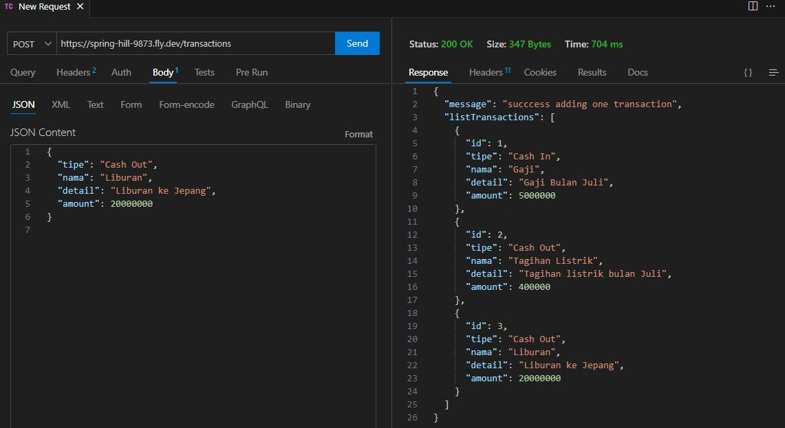

<h3 align="center">
Hi there, I'm Deffi 👋
</h3>

### 🤝 Connect with me:

[Linkedin](https://www.linkedin.com/in/defficharlinasari/)
[Instagram](https://www.instagram.com/defficharlina/)
- 💬 If you have any question/feedback, please do not hesitate to reach out to me!

# Project Description
This project is about create a simple REST API Server that allows user perform basic CRUD (Create, Read, Update, Delete) operations on transactions [REST API Server](https://spring-hill-9873.fly.dev/)

## Programming Language
1. HTML

    HTML is the markup language that we use to structure and give meaning to our web content, for example defining paragraphs, headings, and data tables, or embedding images and videos in the page.

2. CSS

    CSS is a language of style rules that we use to apply styling to our HTML content, for example setting background colors and fonts, and laying out our content in multiple columns.

3. TypeScript

    TypeScript is a free and open-source high-level programming language developed by Microsoft that adds static typing with optional type annotations to JavaScript.

4. JavaScript

    JavaScript is a scripting or programming language that allows you to implement complex features on web pages — every time a web page does more than just sit there and display static information for you to look at — displaying timely content updates, interactive maps, animated 2D/3D graphics, scrolling video jukeboxes, etc.

## Dev Environment Setup
1. GitHub

    Create GitHub Account, please visit [GitHub](https://github.com/)

2. Power Shell

    For installation, please visit [Power Shell](https://learn.microsoft.com/en-us/powershell/scripting/install/installing-powershell-on-windows?view=powershell-7.3#install-powershell-using-winget-recommended)

3. Visual Studio Code

    For installation, please visit [Visual Studio Code](https://code.visualstudio.com/)

4. Fly.io

   Create Fly.io Account, please visit [Fly.io](https://fly.io/)

5. Docker

    Install Docker, please visit [Docker](https://www.docker.com/)

6.  Node.js

    Node.js is a cross-platform, open-source server environment that can run on Windows, Linux, Unix, macOS, and more.

7. Thunder Client

    Install Thunder Client, please visit [Thunder Client](https://www.thunderclient.com/)

## Process
1. Install Node.js in Dockerfile
2. Setup project with new express js application

  

    
  

  

    
  

3. Open Thunder Client, use New Request to put the link deploy and try GET and POST
4. There is GET /transactions for returns a list of all posts 

  

    
  

5. There is GET /transactions/:id for return a spesific post with the given ID 

  

    
  

6. There is POST /transactions for create new post

  

    
  

7. Deploy the project with Fly.io

## Deployment Process
1. Open Power Shell as administrator, Run the PowerShell install script **pwsh -Command "iwr https://fly.io/install.ps1 -useb | iex"**
2. Go to directory that we use
3. Using this comment to login **fly auth login**

  

    
  

4. Using comment **flyctl launch**

  

    
  

  

    
  

5. Using this comment **flyctl deploy**
6. Using this comment **flyctl status**
7. Check the deploy

  

    
  

  

    
  

